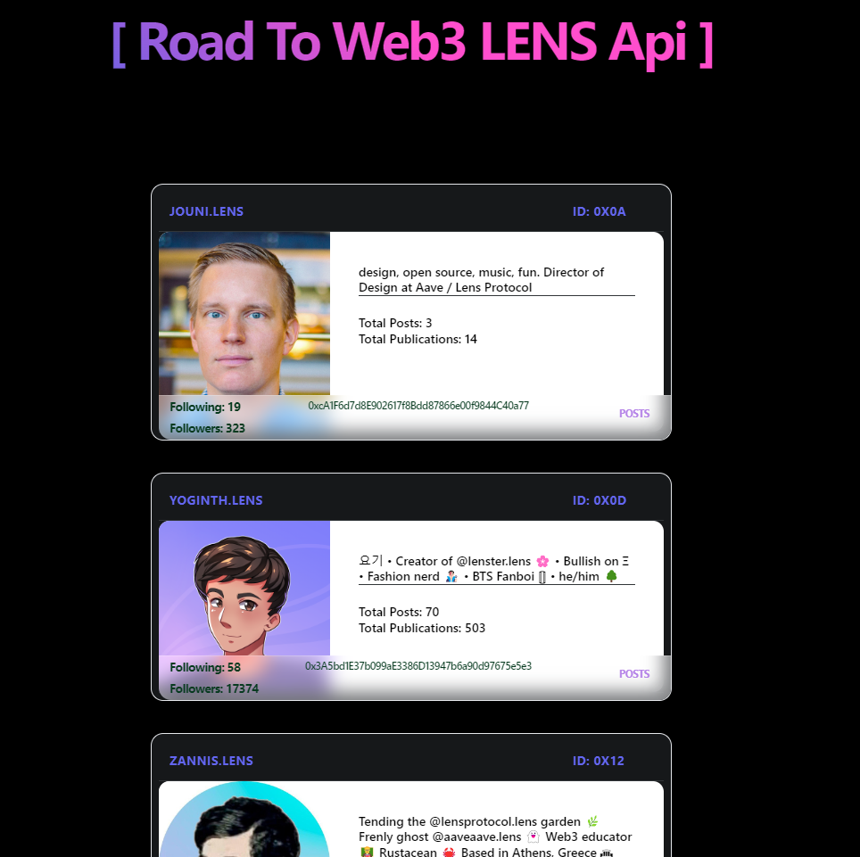
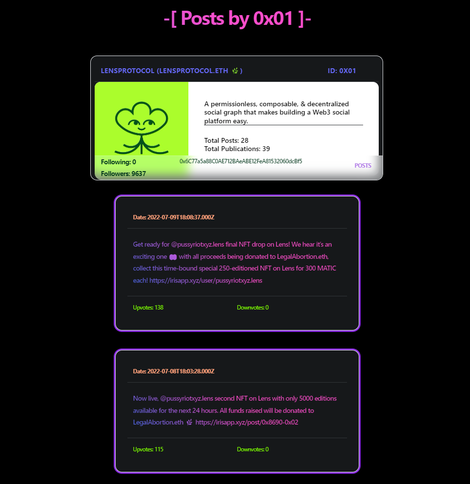

## Project:

- Set up a Next.js app with an Apollo GraphQL client
- Use the Lens protocol API to fetch profiles, posts, and other data stored on the Polygon blockchain
- Use MintKudos API -- so that you can integrate your PoK tokens in your dapp!
- Use Lit Protocol -- in case you want to encrypt certain posts to only be shown to various community members


## Components/Libraries:

- React/Next.js
- Tailwind
- NextUI
- Apollo GraphQL






## TODO:

- Finish the project adding:
- List handle NFTs
- POST/Comments search by keyword
- List latest Publications
- List of Communities with pagination


## Getting Started

First, run the development server:

```bash
npm run dev
# or
yarn dev
```

Open [http://localhost:3000](http://localhost:3000) with your browser to see the result.

You can start editing the page by modifying `pages/index.js`. The page auto-updates as you edit the file.

[API routes](https://nextjs.org/docs/api-routes/introduction) can be accessed on [http://localhost:3000/api/hello](http://localhost:3000/api/hello). This endpoint can be edited in `pages/api/hello.js`.

The `pages/api` directory is mapped to `/api/*`. Files in this directory are treated as [API routes](https://nextjs.org/docs/api-routes/introduction) instead of React pages.

## Learn More

To learn more about Next.js, take a look at the following resources:

- [Next.js Documentation](https://nextjs.org/docs) - learn about Next.js features and API.
- [Learn Next.js](https://nextjs.org/learn) - an interactive Next.js tutorial.

You can check out [the Next.js GitHub repository](https://github.com/vercel/next.js/) - your feedback and contributions are welcome!

## Deploy on Vercel

The easiest way to deploy your Next.js app is to use the [Vercel Platform](https://vercel.com/new?utm_medium=default-template&filter=next.js&utm_source=create-next-app&utm_campaign=create-next-app-readme) from the creators of Next.js.

Check out our [Next.js deployment documentation](https://nextjs.org/docs/deployment) for more details.
